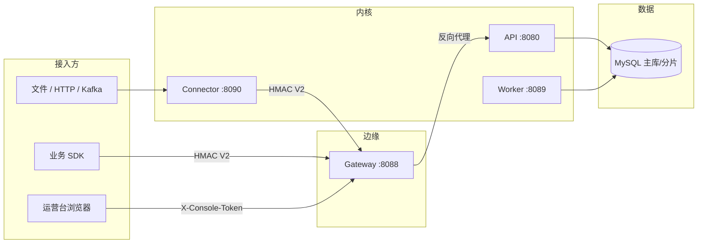
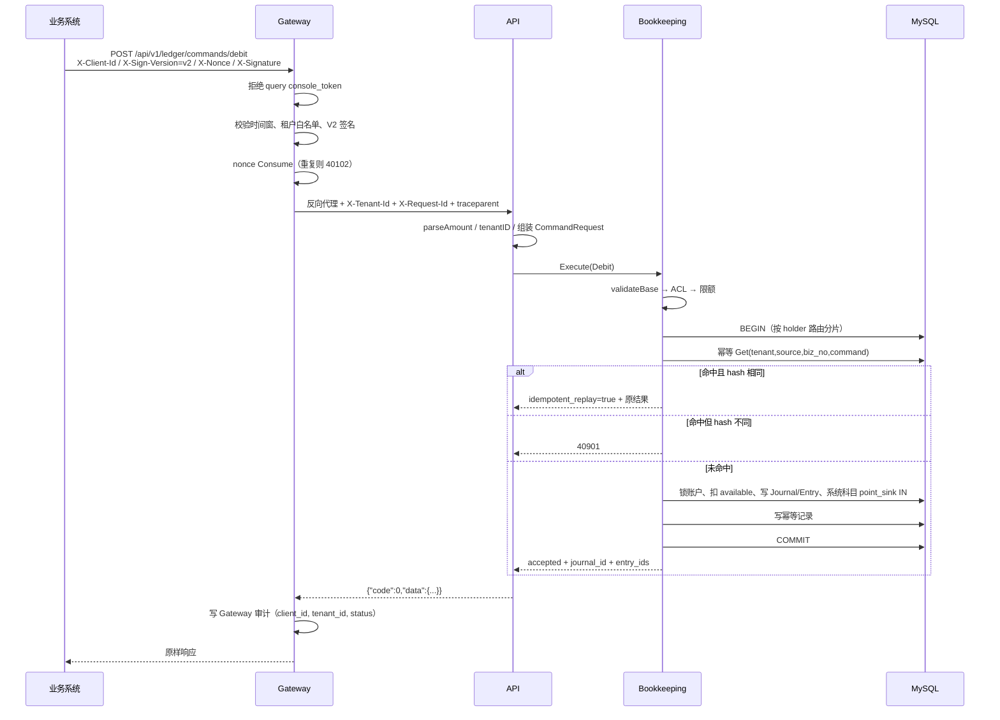
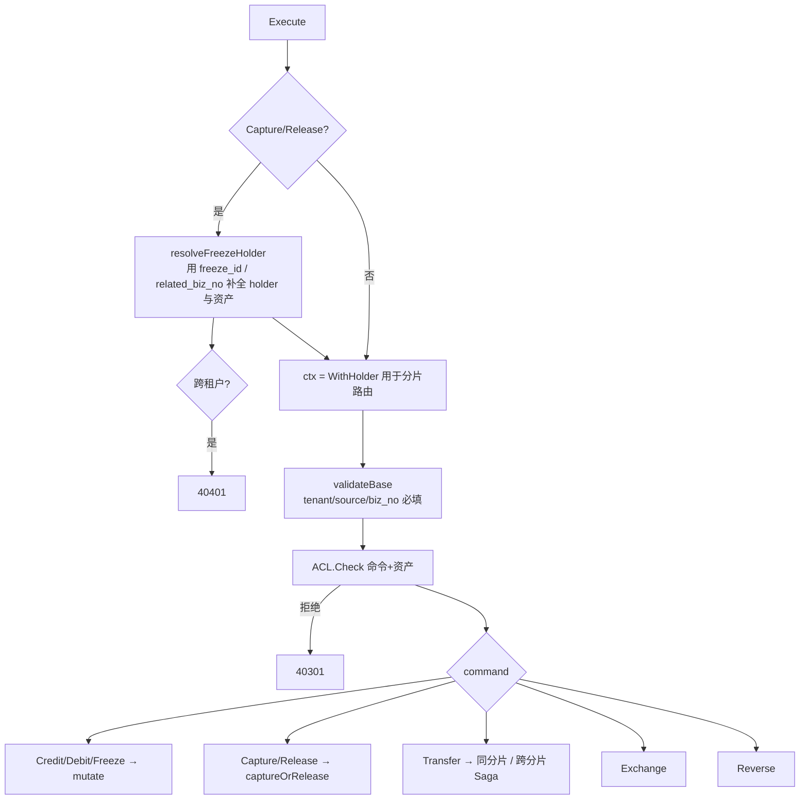
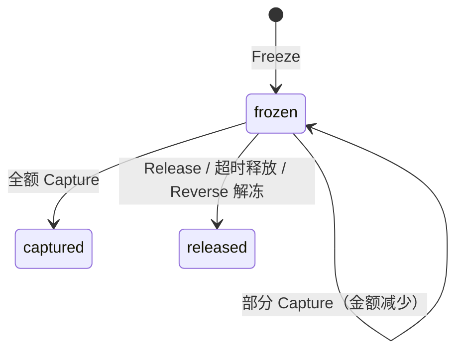
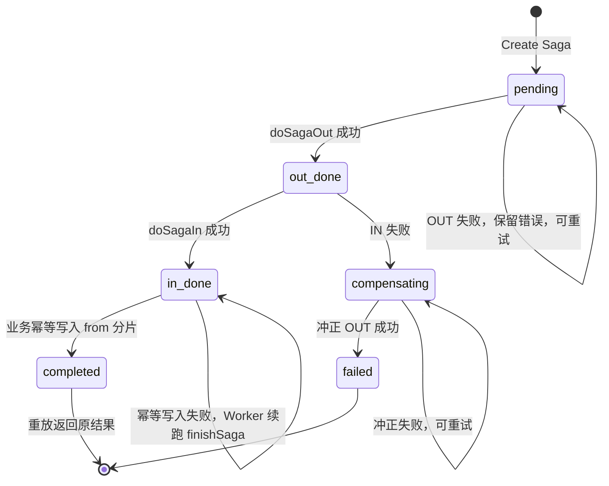
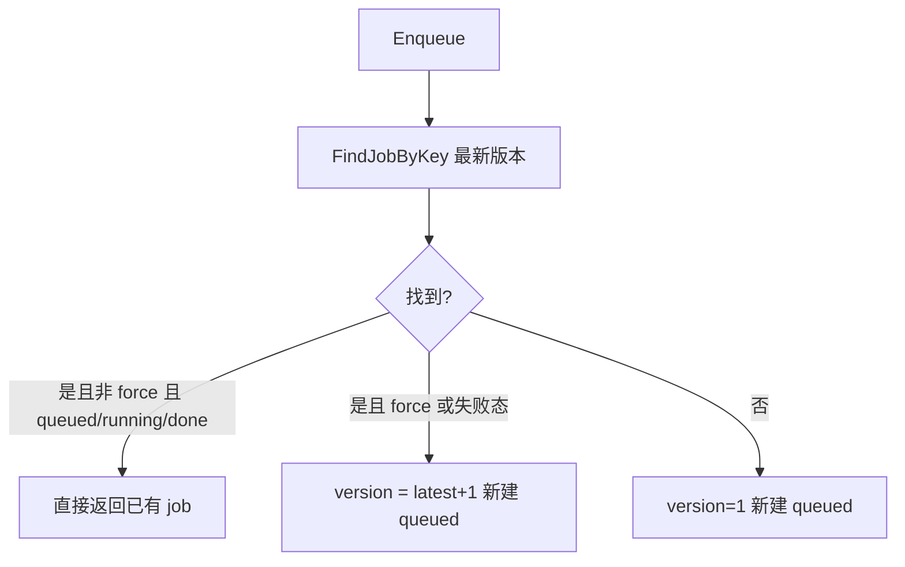
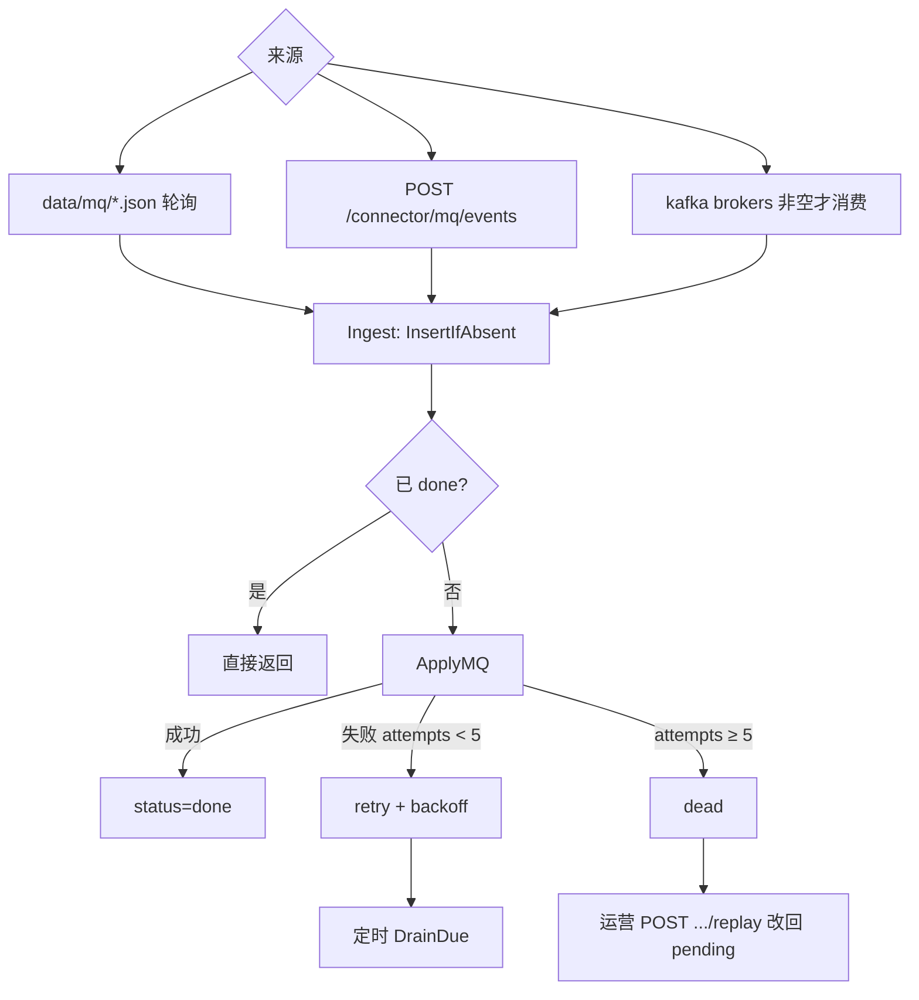

# Ledger Hub 功能实现逻辑流程分析

本文按**当前仓库源码**梳理实现路径，覆盖 P0（租户隔离、签名 V2、跨分片 Saga、输入校验）与 P1（Worker 租约、探针与指标、migration、密钥、异步对账、Connector inbox）。不描述未实现的 P2。

对照代码入口：

| 层 | 主要文件 |
|---|---|
| Gateway | `internal/gateway/server.go`、`pkg/sign/sign.go` |
| HTTP | `internal/iface/http/server.go`、`ops.go` |
| 记账内核 | `internal/application/bookkeeping.go`、`saga.go`、`exchange.go`、`reverse.go` |
| Worker | `internal/worker/runner.go`、`internal/application/jobs.go`、`lease.go` |
| 对账 | `internal/application/reconcile.go` |
| Connector | `internal/connector/`、`cmd/connector/main.go` |
| 持久化 | `internal/infrastructure/persistence/` |

系统边界：Ledger Hub **只记账**。订单状态、库存、支付渠道路由、券码、会员等级不在本系统。运营台**没有**任意加减余额按钮；纠错一律走 `Reverse`。

---

## 1. 进程拓扑与流量入口

本地默认四个进程：

```text
业务系统 / SDK / 运营浏览器
        │
        ▼
   Gateway :8088     HMAC V2（兼容 V1）· nonce · 租户白名单 · 限流 · 审计
        │ 反向代理，转发 X-Tenant-Id / X-Request-Id / traceparent
        ▼
   Ledger API :8080  命令、查询、运营、对账入队、OpenAPI、/console
        │
        ├── MySQL 主库 + 可选分片（账户/流水/冻结/幂等按 holder_id 哈希）
        │
Worker :8089 ──┤ 租约互斥后跑：超时释放、Saga 续跑、对账 drain、过期、汇率、幂等清理
        │
Connector :8090 ── 订单/支付事件 → inbox → 调 Gateway 记账
```



直连 API `:8080` 仅用于本地开发；**生产流量必须走 Gateway**。C 端 App 不得持有密钥。

---

## 2. 一笔记账命令的端到端时序

以 `wallet` 对 Alice 做 `Debit POINT 10` 为例。



---

## 3. Gateway 鉴权决策树

入口：`internal/gateway/server.go` 的 `auth()`。路由：

- `/console`、`/console/*`：`auth → audit → forward`（无限流）
- `/api/*`：`auth → 每 client 秒桶限流 → audit → forward`

```mermaid
flowchart TD
  START[收到请求] --> QTOK{query 含 console_token?}
  QTOK -->|是| R401A[40100 禁止出现在 query]
  QTOK -->|否| HTOK{Header X-Console-Token 匹配?}
  HTOK -->|是| CON[client_id=console<br/>租户=X-Tenant-Id<br/>放行]
  HTOK -->|否| CID{X-Client-Id 在配置中?}
  CID -->|否| R401B[40100 未知 client_id]
  CID -->|是| SIG{X-Signature 与 X-Timestamp 齐全?}
  SIG -->|否| R401C[40100 缺少签名]
  SIG -->|是| SKEW{|now-ts| ≤ max_skew?}
  SKEW -->|否| R401D[40100 时间戳超出窗口]
  SKEW -->|是| PEEK[读 body：校验 source_system==client_id]
  PEEK --> TENANT[解析租户：Header → body.tenant_id → default_tenant]
  TENANT --> ALLOW{client.tenants 允许?}
  ALLOW -->|否| R403[40301 无权访问该租户]
  ALLOW -->|是| KEY{X-Key-Version 对应密钥存在?}
  KEY -->|否| R401E[40100 未知密钥版本]
  KEY -->|是| VER{签名版本}
  VER -->|V1| V1[HMACSHA256 client+ts+body]
  VER -->|V2 或缺省但带 Nonce| V2[HMACV2 method/path/query/tenant/ts/nonce/bodyhash]
  V1 --> CMP{hmac.Equal?}
  V2 --> NEEDN{nonce 非空?}
  NEEDN -->|否| R401F[40100 V2 需要 nonce]
  NEEDN -->|是| CMP
  CMP -->|否| R401G[40100 签名失败]
  CMP -->|是| NV2{V2?}
  NV2 -->|是| NONCE[Consume nonce]
  NONCE -->|重复| R401H[40102 重放]
  NONCE -->|成功| OK[写入 client_id/tenant_id<br/>转发前强制 X-Tenant-Id]
  NV2 -->|否| OK
```

要点：

1. **验签在 nonce 消费之前**。签名错误不会烧掉 nonce；只有 V2 验签通过才 `Consume`。
2. V2 覆盖字符串（`pkg/sign`）：`v2\nclient\nMETHOD\npath\ncanonicalQuery\ntenant\nts\nnonce\nsha256(body)`，再 HMAC-SHA256。
3. `AcceptSignVersions` 为空时同时收 V1/V2。带 `X-Nonce` 且未声明版本时按 V2。
4. `client.tenants` 为空则兼容放行（测试）；配置了列表则必须命中或 `*`。
5. Header 租户与 body `tenant_id` 不一致 → `40301`。
6. 审计在 handler 返回后写：`client_id`、`tenant_id`、method、path、status、`request_id`。

---

## 4. API 命令入口与输入校验

`POST /api/v1/ledger/commands/{credit|debit|...}` 或聚合 `POST /commands`（body 带 `"command"`）。

`handleCommand` 顺序：

1. 绑定 JSON → `commandDTO`
2. `parseAmount`：空字符串视为 `0`；拒绝含 `.eE+` 的输入（金额必须是最小单位整数，JSON 用字符串）
3. `from.amount` / `to.amount` / `fee.amount` / `tolerance` 任一非法 → `40001`，**不得静默成 0**
4. `tenantID`：`X-Tenant-Id` 优先，否则 DTO，否则配置默认租户
5. 组装 `domain.CommandRequest`，调用 `Bookkeeping.Execute`
6. 成功 `{"code":0,"data":...}`；失败按领域错误码映射 HTTP 状态

查询时间 `parseTimeRange`：

- `from`/`to` 非法 RFC3339 → `40001`
- 必须 `from < to`
- 跨度 ≤ 366 天

按 ID 查询（账户、冻结、Journal、汇率、对账任务）一律带当前租户；仓储或应用层 `tenantMatch` 失败返回 **`40401`（不是 403）**，避免枚举其他租户资源。

---

## 5. Bookkeeping.Execute 总控



`validateBase`：

- 任意命令：`tenant_id`、`source_system`、`biz_no` 必填
- Reverse：还要 `related_biz_no`；holder 可稍后从原分录推断
- 非 Capture/Release：`holder.id` 与 `asset_code` 必填

ACL：按 `tenant + source_system + command + asset` 匹配 yaml 规则；`*` 通配。Exchange 还校验 `to.asset_code`。

分片：`TxManager.WithinTx` 用 `domain.HolderIDFrom(ctx)` 选择分片连接。因此 Capture 必须先解析冻结单所属 holder，再进事务。

---

## 6. 幂等

键：`(tenant_id, source_system, biz_no, command)`。

请求哈希覆盖命令、租户、来源、业务号、holder、金额、对手方、汇率等（`requestHash`）。同一键：

| 情况 | 结果 |
|---|---|
| 无记录 | 继续记账，成功后写入响应 JSON |
| 有记录且 hash 相同 | 返回原结果，`idempotent_replay=true` |
| 有记录但 hash 不同 | `40901` 幂等冲突 |

幂等记录与余额变更在**同一事务**内提交（同片 Transfer / Credit 等）。跨分片 Transfer 的业务幂等写在 **from 分片**、Saga 完成之后；若此时失败，Saga 停在 `in_done`，Worker 可续跑 `finishSaga`。

Worker 定时按 `idempotency_retain`（默认 192h）清理过期幂等行。

---

## 7. 各记账命令的资金与分录

恒等式：**`total = available + frozen`**。金额均为最小单位 int64。系统科目允许透支（`systemOverdraft`），用户账户默认不允许。

### 7.1 Credit（入账）

路径：`mutate → applyCredit`

1. `amount > 0`
2. 资产启用、holder 类型允许、账户可用
3. 限额 Check
4. `available += amount`
5. Journal `posting`，用户分录 **IN**，系统科目 `point_issuance` **OUT** 等额

谁用：campaign 发积分、pay 入法币、wallet。

### 7.2 Debit（出账）

路径：`mutate → applyDebit`

1. `amount > 0`；`available` 不足且不允许透支 → `42201`
2. `available -= amount`
3. 用户 **OUT**，系统科目 `point_sink` **IN**

谁用：wallet；积分过期不走 Debit，而走 Transfer 到 `point_sink`。

### 7.3 Freeze（预占）

路径：`mutate → applyFreeze`

1. 资产 `FreezeSupported`
2. `available` 足够
3. `available -= amount`，`frozen += amount`（总额不变）
4. 插入冻结单 `status=frozen`，唯一键 **`(tenant_id, biz_no)`**
5. 用户分录 **OUT**（从 available 划出），带 `freeze_id`

超时：Worker `ReleaseExpired` 对已过 `expire_at` 仍 frozen 的单发 `Release`，`biz_no=worker:expire:{freeze_id}`。

### 7.4 Capture / Release

路径：先 `resolveFreezeHolder`（租户必须匹配），再 `captureOrRelease`。

定位冻结单：`freeze_id` → `related_biz_no` → 当前 `biz_no`。状态必须是 `frozen`，否则 `42202`。

锁账户后校验 `account.frozen >= freeze.amount`。



| 动作 | 余额 | 分录方向 | 冻结单 |
|---|---|---|---|
| 全额 Capture | `frozen -= amt`，available 不变（资金被确认消耗） | OUT | `captured` |
| 部分 Capture | 同上，但冻结单 `amount` 改为剩余 | OUT | 仍 `frozen` |
| Release | `frozen -= amt`，`available += amt` | IN | `released` |

Capture 金额若传入且 `> 剩余冻结` → `40001`。未传金额则全额确认。

### 7.5 Transfer（同币种）

```mermaid
flowchart TD
  T[Transfer] --> TH{to_holder?}
  TH -->|无| E1[40001]
  TH -->|有| CC{to.asset ≠ from.asset?}
  CC -->|是| E2[禁止，请用 Exchange]
  CC -->|否| AMT{amount > 0?}
  AMT -->|否| E3[40001]
  AMT -->|是| SH{sameShard(from,to)?}
  SH -->|否| XS[crossShardTransfer / Saga]
  SH -->|是或未配置分片| SS[transferSameShard 单事务]
```

**同片** `transferSameShard`：

1. 幂等 → 限额 → 资产启用 → 双方 holder 类型合法
2. **按 `type:id` 字典序加锁**，避免 AB/BA 死锁
3. from `available -=`，to `available +=`；系统科目可透支
4. Journal 类型 `transfer`，from OUT + to IN

**跨片**见第 8 节。

### 7.6 Exchange（同一 holder 跨币种）

1. `to.asset_code` 必须存在且不同于 from
2. 解析汇率快照：`rate_id` 必须属于本租户；或按 base/quote 取当前快照
3. `ExpectedToAmount` 按精度换算；请求 `to.amount` 为空则用期望值
4. 超出 `tolerance` → `42203` 滑点拒绝
5. 按资产 code 排序加锁两个账户
6. from 扣减、to 增加；可选 fee 进 `fx_fee_income`
7. 写 `ExchangeLeg` 供对账 L4

### 7.7 Reverse（冲正）

1. 必须 `related_biz_no`；列出原分录，若有 `journal_id` 则按凭证拉齐全部分录
2. 原分录已是 Reverse → 拒绝（禁止套冲）
3. 对每条原分录：
   - 若原命令是 Freeze 且冻结单仍 frozen：解冻（frozen→available）并记 IN，状态 `released`
   - 若原方向 IN：扣回 available（不足则 `42201`）
   - 若原方向 OUT：加回 available
4. 新 Journal 类型 `reverse`，`ext` 挂原 journal_id
5. **不改原流水**，只追加反向分录

运营台流水页冲正走同一命令，`source_system` 仍须在 ACL 内（wallet / worker）。

---

## 8. 跨分片 Transfer Saga

当 `sameShard(from_id, to_id)==false` 且配置了 `SagaRepository`：

幂等键（相对业务 `biz_no`）：

| 腿 | 稳定 biz_no |
|---|---|
| OUT | `{biz_no}:xshard:out` |
| IN | `{biz_no}:xshard:in` |
| 补偿 | `{biz_no}:xshard:rollback` 冲正 OUT 腿 |

资金路径：

```text
用户 A  ──OUT──►  system_subject:pending_settlement   （在 A 的分片）
pending_settlement ──IN──►  用户 B                   （在 B 的分片）
```



`resumeSaga` 按状态 fallthrough：`pending` 做完 OUT 立刻尝试 IN。IN 失败会**同步尝试补偿**，并返回 IN 错误。

无 Saga 仓储时走 `crossShardOnce`（两次本地事务 + 失败冲正），供单测；生产 API/Worker 已 `WithSaga`。

运营：

- `GET /ops/sagas?status=`（空或 `open` = 未完成）
- `POST /ops/sagas/:id/retry` → `ResumeSaga`
- `POST /ops/sagas/:id/compensate` → 置 `compensating` 再 resume
- Worker 每 15s `ResumeOpenSagas`
- 对账扫描 pending_settlement，差异类型 `cross_shard_inflight`

---

## 9. 租户隔离

| 环节 | 行为 |
|---|---|
| Gateway | `client.tenants` 白名单；审计记最终 `tenant_id` |
| HTTP | 查询/变更带 `s.tenantID(c)` |
| 应用 | `tenantMatch`：不匹配 → `ErrNotFound` |
| 冻结定位 | `fz.TenantID`、账户 `TenantID` 必须等于请求租户 |
| 汇率按 id | snapshot 的 `TenantID` 必须匹配 |
| 关差异 | 先在本租户 open diffs 中查找 |

跨租户拿到别人的 `account_id` / `freeze_id` **只能看到 404**。

---

## 10. Worker 租约与作业框架

每个 Worker 启动生成 `instance_id = hostname-pid-uuid前8位`。

每个 ticker 任务名独立租约（`ledger_job_lease.job_name` UNIQUE）：

1. `Acquire(job, instance, ttl)`：行锁；无行则插入；他持有且未过期则失败；过期或本人则可接管
2. 未拿到租约 → skip
3. 拿到后 `Hold`：另起 goroutine 每 `ttl/3` `Renew`
4. 任务函数在 Hold 内执行

任务表：

| 任务名 | 默认周期 | 做什么 |
|---|---|---|
| `release_expired` | 30s | 过期冻结 Release |
| `queued-reconcile` | 15s | drain 状态 `queued` 的对账任务 |
| `saga` | 15s | 续跑未完成 Saga |
| `reconcile` | 1h | 为每个活跃租户 **Enqueue** 昨日日终（去重） |
| `expire` | 24h | 积分过期转入 `point_sink` |
| `fx_feed` | 1h | 写配置中的汇率快照 |
| `idempotency` | 1h | 清理过期幂等 |

`Jobs.track` 落 `ledger_ops_run`：`instance_id`、`attempt`、`last_error`、`duration_ms`、status=`running/done/failed/dead`。失败可指数退避；超过最大尝试 → `dead`。

运营 `POST /ops/jobs/:name` **不经过租约**（人工触发），并写 ops audit。

---

## 11. 异步对账与差异工单

### 11.1 入队

HTTP `POST /reconcile/jobs` 只调 `Enqueue`，返回 **202** + `job_id`。

唯一维度：`(tenant_id, biz_date, source_system, asset_code, job_type, version)`。空来源/资产记空串；`job_type` 默认 `daily`。



`Trigger`（单测 / SeedDemo）：Enqueue 后若尚未 done 则立刻 `RunJob`。HTTP 不走这条同步路径。

`Rerun`：带原 payload `forceNew=true` 再入队。

### 11.2 执行 `RunJob`

1. 已 `done` 则只读返回
2. 置 `running` / `phase=matching`
3. 拉当日流水，L1 业务行勾稽（若有 `biz_lines`）
4. L2 余额恒等、L3 冻结勾稽、L4 兑换完整性、L5 渠道行、pending_settlement 在途
5. 写 diffs、CSV 到 `app.reconcile_dir`，置 `done` 或 `failed`

Worker `DrainQueued` 领取 queued 任务。

### 11.3 差异工单

关闭 **只改工单状态，不改余额**。补账必须再发命令。

- `POST /reconcile/diffs/:id/assign`：assignee + 事件
- `POST /reconcile/diffs/:id/resolve`：`closed_by` / `closed_at` + 事件
- `GET /reconcile/diffs/:id/events`：指派/备注/关闭历史
- 文件下载经 Gateway header，审计记录；禁止 `?console_token=`

---

## 12. Connector 与 inbox



`ApplyMQ`：`topic=order` → Freeze/Capture/Release；`topic=pay` → Credit（含退款 Credit）。事件带 `schema_version`（默认 1）。

成功处理的文件改名为 `.done`。运营可查 inbox 并安全重放 dead 消息。

---

## 13. 配置、密钥、Migration、可观测性

**密钥**：yaml 加载后用环境变量覆盖 `LEDGER_GATEWAY_CONSOLE_TOKEN`、`LEDGER_GATEWAY_CLIENT_<ID>_SECRET`。`app.env=prod` 时若仍是 `dev-*` 或空密钥则**拒绝启动**。日志不打印密钥。

**配置热加载**：API 每 15s 看 yaml mtime，或 `POST /ops/reload`。成功则 `ACL.Replace` / `Limiter.Replace`，并写入 `ledger_config_revision`（版本、操作人、checksum、payload）。`GET /ops/config/revisions` 可审计。

**Migration**：`cmd/migrate`（`make migrate`）跑版本化 SQL，写入 `ledger_schema_migration`。`app.env=prod` 时 API/Worker **默认不 AutoMigrate**。演进约定 expand（加可空列）→ 回填 → contract（加约束）。

**探针**：

| 路径 | 含义 |
|---|---|
| `/livez`、`/healthz` | 进程存活 |
| `/readyz` | API/Worker：`SELECT 1` 主库+分片；Gateway：探测上游 `/livez`，结果缓存约 5s |
| `/metrics` | Prometheus：HTTP、命令结果、Saga pending、Worker 作业 |

链路：始终传播 W3C `traceparent` 与 `X-Request-Id`；仅当 `OTEL_EXPORTER_OTLP_ENDPOINT` 设置时导出。日志字段含 `request_id`、`trace_id`、`tenant_id`、`client_id`，命令成功后可带 `biz_no` / `journal_id`。

---

## 14. 错误码与 HTTP

对外错误信封：`{"code":40118,"error":"SIGNATURE_MISMATCH","message":"..."}`。

- `code` / `error` 与语言无关；`message` 由 `Lang` / `X-Lang` / `Accept-Language` 决定（默认中文）。
- HTTP 状态 = `code / 100`。

| 码族 | 典型 error |
|---|---|
| 400xx | `AMOUNT_NOT_INTEGER`、`TIME_FROM_INVALID`、`ASSET_DISABLED` |
| 401xx | `UNKNOWN_CLIENT`、`MISSING_SIGNATURE`、`REPLAY`、`SIGNATURE_MISMATCH` |
| 403xx | `FORBIDDEN`、`SOURCE_SYSTEM_MISMATCH`、`TENANT_NOT_ALLOWED` |
| 40401 | `NOT_FOUND`（含跨租户） |
| 40901 | `IDEMPOTENCY_CONFLICT` |
| 422xx | `INSUFFICIENT_BALANCE`、`FREEZE_STATE_INVALID`、`SLIPPAGE_EXCEEDED` |
| 42901 | `RATE_LIMITED` |
| 5xxxx | `INTERNAL_ERROR`、`SAGA_FAILED`、`UPSTREAM_ERROR`、`NOT_READY` |

---

## 15. 演示账与核对线索

API 启动幂等 `SeedDemo`。检索 `u_alice`：POINT available **7050** / frozen **600**（含一笔过期冻，Worker ~30s 会 Release）；CNY **1049900**；USD **14000**；COIN **6250** / 冻 **1500**。另有 `u_dave`、`u_eve`、`u_vip`、`t_mall`/`t_game` 演示账，对账差异含 missing / extra / 已关单的 amount_mismatch。

核对一笔命令是否成功，按顺序查：

1. Gateway 审计是否 2xx、tenant 是否预期
2. 幂等表是否有 `(tenant, source, biz_no, command)`
3. Journal + 分录借贷是否平衡（Credit/Debit/Transfer/Exchange）
4. `available + frozen` 是否等于期望总额
5. 跨片则再查 `ledger_transfer_saga` 状态与 `pending_settlement` 是否轧平
